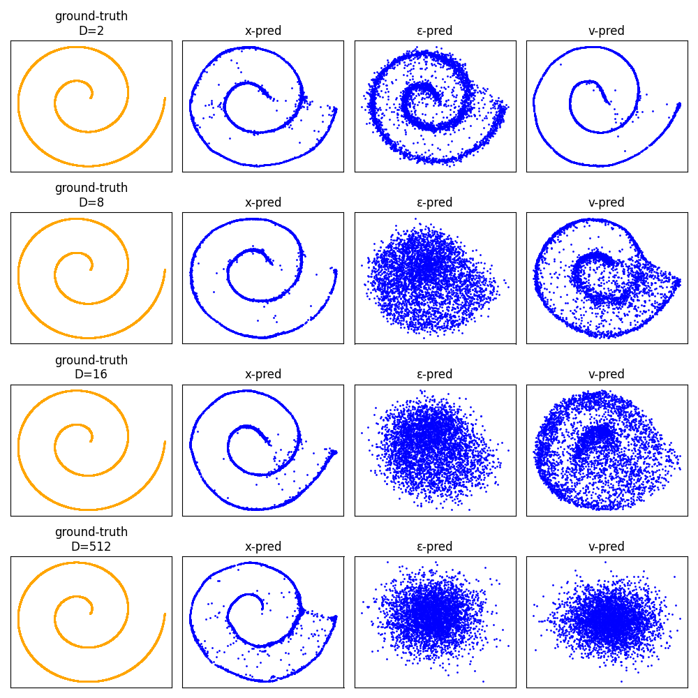

# Reproducing Figure 2 from “Back to Basics: Let Denoising Generative Models Denoise”

This repo contains a minimal Colab-friendly implementation that recreates **Figure 2** from the paper:  
https://arxiv.org/abs/2511.13720

The goal is to show how **x-prediction**, **ε-prediction**, and **v-prediction** behave when the observed dimensionality `D` increases, while the underlying data lies on a low-dimensional manifold (`d = 2` spiral).

---

## Method Summary
- Underlying data: **2D spiral**  
- Embedded into `D` dimensions using a **random column-orthogonal projection**  
- Model: **5-layer ReLU MLP (256 hidden units)**  
- Prediction types implemented:
  - **x-pred** → directly predicts clean data  
  - **ε-pred** → predicts noise  
  - **v-pred** → velocity prediction  
- Observation from the paper (and reproduced here):
  - As `D` grows, **only x-prediction remains stable**  
  - ε-pred and v-pred collapse due to high-dimensional noise geometry

---

## Output

#
